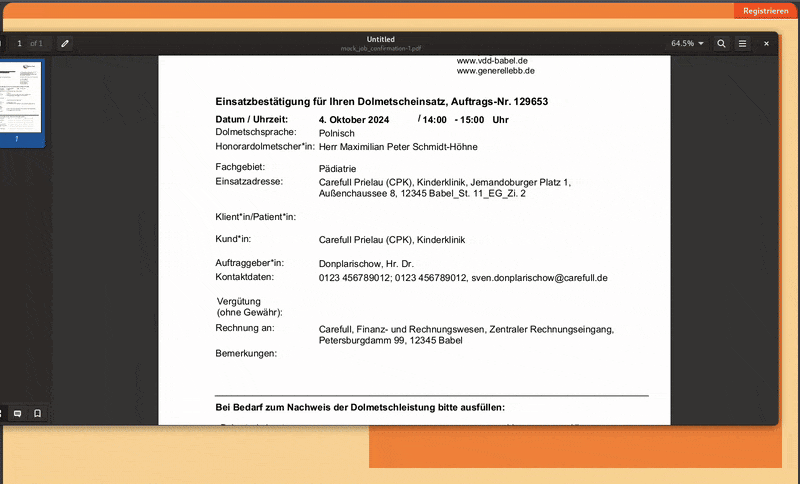

# Jerp 

### JavatoolforinTERPreters

Mit dem Web-basierten Tool können Rechnungen automatisch aus Einsatzbestätigungen erstellt werden.

Man lädt das PDF der Einsatzbestätigung hoch und erhält ein PDF mit der Rechnung. Im lokalen Betrieb werden alle Dokumente in einem konfigurierbaren Ordner abgelegt.

Für Einsatzbestätigungen der  geeignet.

